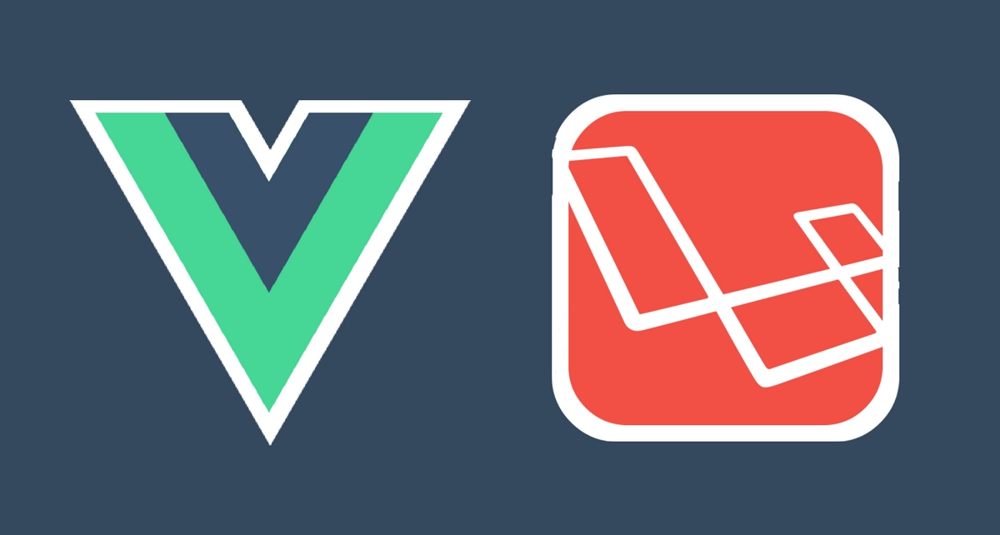

# Laravel + Vue Full Demo

Laravel & VueJS integration

# Download code to local machine

Close the repository from github clone link

# Setup & Configure Laravel

go to the folder where repository cloned or downloaded the code via terminal

run composer install

configure database credentials in .env file

DB_CONNECTION=mysql
DB_HOST=127.0.0.1
DB_PORT=3306
DB_DATABASE=laravuefulldemo
DB_USERNAME=root
DB_PASSWORD=

run php artisan config:cache

run php artisan migrate

run php artisan db:seed

Now your backend is ready

# Setup & Configure VueJS

run npm install

run npm run dev to create the build

run php artisan migrate

now you can access the setup from brower 

# Contact for more 

Contact me for more demos and queries if you have any

Krutik Patel

Email: kkrutikk@gmail.com

LinkedIn: https://www.linkedin.com/in/krutik-patel/

Skype: krutik9223
